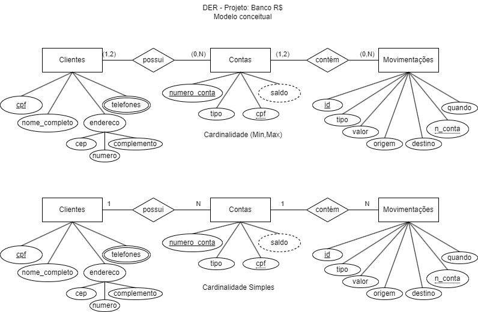

# Aula03
## SQL DDL
A partir do planejamento MER, Dicionário de dados e MER, DER da aula anterior, vamos desenvolver a estrutura do banco de dados<br>

```sql
-- SQL Script que exclui o banco anterior e cria um novo caso exista
drop database if exists banco;
create database banco;
use banco;

-- DDL
create table Clientes(
    cpf varchar(20) not null primary key,
    nome varchar(100) not null,
    nascimento Date not null,
    enderecoCep varchar(10) not null,
    enderecoNumero varchar(6),
    enderecoComplemento varchar(50)
);

create table Telefones(
    id int not null primary key auto_increment,
    cpf varchar(20) not null,
    tipo varchar(20) not null,
    telefone varchar(20) not null,
    foreign key (cpf) references Clientes(cpf)
    on delete cascade on update cascade
);

create table Contas(
    nConta int not null primary key auto_increment,
    cpf varchar(20) not null,
    tipo varchar(20) not null,
    foreign key (cpf) references Clientes(cpf)
);

create table Movimentacoes(
    id int not null primary key auto_increment,
    tipo varchar(20) not null,
    valor float(10,2) not null,
    origem varchar(50) not null,
    destino varchar(50) not null,
    nConta int not null,
    quando datetime not null default(curtime()),
    foreign key (nConta) references Contas(nConta)
);

```

# Para testar o script
- 1 Abra o XAMPP e clique em start nos serviços Apache e MySQL
- 2 Abra um terminal "cmd" e acesse o mysql.
```bash
mysql -u root
```
- 3 Copie o script e cole no terminal
- 4 No XAMPP clique em **Admin** a frente do serviço **MySQL** para abrir o PHPMyAdmin
- 5 No ambiente gráfico do PHPMyAdmin clique no nome do banco de dados e em seguida procure o ítem do menú **Desenhador" para ve o **DER Lógico**.

