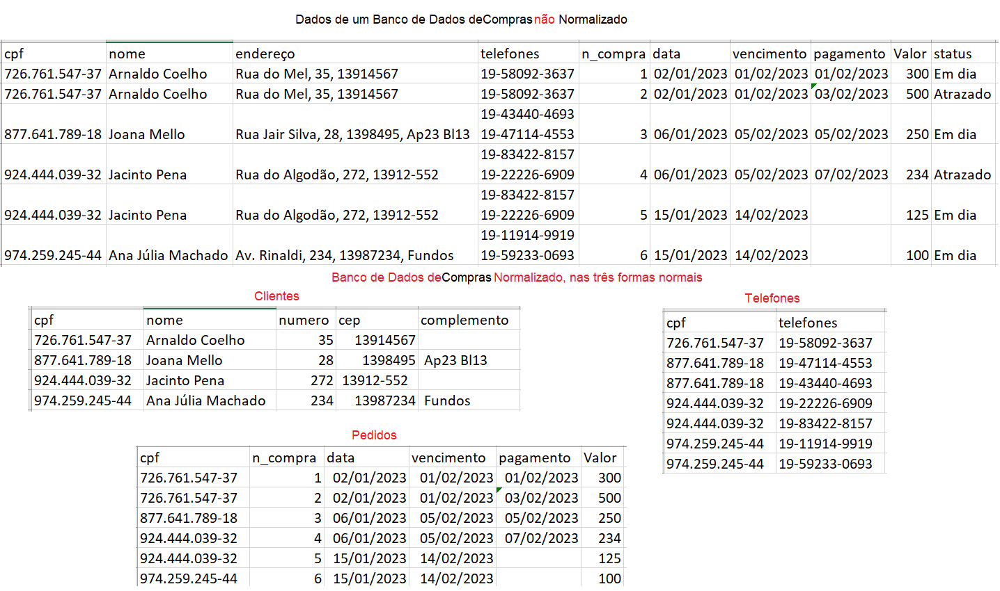
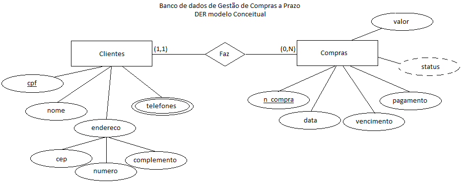

# Aula06 - Normalização

O processo de normalização consiste em separar dados brutos em tabelas relacionais.

## Benefícios
- Reduz redundância
- Reduz inconcistência
- Melhora o desempenho

## Passos e níveis de normalização
### Primeira forma normal
- Identificar atributos/campos **compostos**
- Dividí-los em várias colunas
  - ex: atributo **endereço** dividido em **cep, número e complemento**
### Segunda forma normal
- Estar na primeira forma normal
- Identificar atributos/campos **multivalorados**
- Separa-los em outra tabela, relacionada por chave estrangeira
  - ex: **telefones** criar uma tabela de telefones
  - utilizar as chaves primárias e estrangeiras para relacionar
- Identificar atributos/campos **derivados** e eliminar estes campos
### Terceira forma normal
- Estar na segunda forma normal
- Itentificar assuntos e campos que dependem de outras chaves que estão em uma mesma tabela
- Separar estes campos e colocá-los em outra tabela
  - ex: Produtos e Pedidos em uma mesma tabela
  - identificar as chaves e separar as tabelas removendo redundâncias (campos duplicados)
  - ficando uma tabela de produtos e outra de pedidos (1 produto para muitos pedidos)

### OBS
Existe outras mais formas normais, porém trabalharemos inicialmente com estas três.

### Exemplo com um banco de dados de compras

